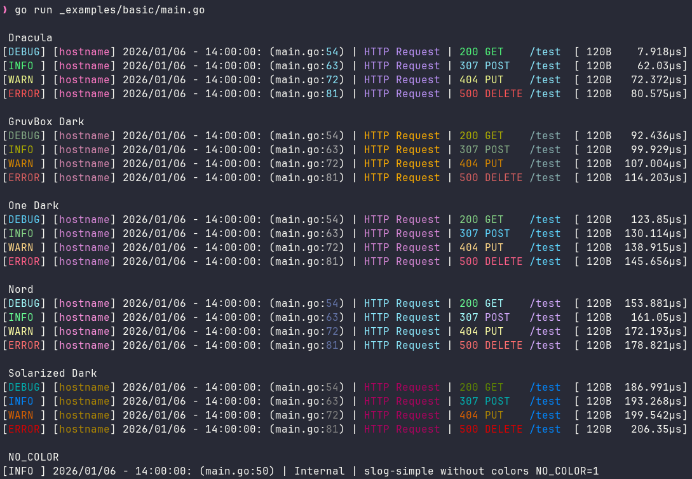

[](https://pkg.go.dev/github.com/tmstorm/slog-human)
[](https://goreportcard.com/report/github.com/tmstorm/slog-human)
[](https://github.com/tmstorm/slog-human/actions/workflows/ci.yaml)
# slog-human

**Pretty, human-readable structured logging for Go's standard lib `log/slog`.**



# Features

- Pretty, aligned, colored console output
- Smart HTTP request formatting with all methods supported
- Middleware for **Chi** and **Gin**
- Remote HTTP logging
- Fully customizable colors
- Built-in themes
- NO_COLOR support

## 🚀 Install
```bash
go get github.com/tmstorm/slog-human

```

## 🔩 Usage

```go
package main

import (
    "log/slog"
    logger "github.com/tmstorm/slog-human"
)

func main() {
    // Optionally set theme
    logger.Colors = logger.Nord

    l := logger.NewDefaultLogger()
    slog.SetDefault(l)
    slog.Info("Hello from slog-human", slog.String("log_type", "Local"))
}

```

This is the fastest way to get up and running with slog-human. See examples for more complex usage.

## 📦 Predefined keys
slog-human uses predefined slog keys to format logs. To ensure proper formatting be sure to pass these when logging.
When logging HTTP Requests ensure an `slog.Attr` of `slog.String("log_type", "http_request")` is passed with the entry.


```go
slog.Info("",
    slog.String("log_type", "http_request"),
    slog.String("method", "GET"),
    // ...
)
```

| Key | Description |
|---|---|
| `log_type` | Used to determine if the log entry is an `http_request` |
| `request_id` | The request id assigned to this log entry |
| `method` | The HTTP Method used in the request |
| `status`| The HTTP status code of the request |
| `path` | The request path |
| `bytes` | The bytes size of the response |
| `duration` | The time taken to respond to the request |


## 🎨 Themes
slog-human uses ANSI color codes to color the string before printing to stdout.
It allows for use of built-in or custom themes via the `logger.Colors` var.

### Built-in

```go
logger.Colors = logger.Dracula
```

| Name | Variable |
|---|---|
| Dracula (default) | `logger.Dracula` |
| Nord | `logger.Nord` |
| Gruvbox Dark | `logger.GruvboxDark` |
| One Dark | `logger.OneDark` |
| Solarized Dark | `logger.SolarizedDark` |

### Custom

If you would like to create your own theme you can do so using the `logger.ColorPalette`. 
Ensure that you set an appropriate `Reset` or the theme might not work correctly.

```go

CustomTheme = logger.ColorPalette{
    MethodGET:     "\033[38;5;84m",
    MethodPOST:    "\033[38;5;159m",
    MethodPUT:     "\033[38;5;222m",
    MethodDELETE:  "\033[38;5;203m",
    MethodPATCH:   "\033[38;5;222m",
    MethodHEAD:    "\033[38;5;84m",
    MethodOPTIONS: "\033[38;5;141m",
    MethodTRACE:   "\033[38;5;248m",
    MethodCONNECT: "\033[38;5;248m",

    Status2xx: "\033[38;5;84m",
    Status3xx: "\033[38;5;159m",
    Status4xx: "\033[38;5;222m",
    Status5xx: "\033[38;5;203m",

    LevelDEBUG: "\033[38;5;159m",
    LevelINFO:  "\033[38;5;84m",
    LevelWARN:  "\033[38;5;222m",
    LevelERROR: "\033[38;5;203m",

    RequestID: "\033[38;5;212m",
    Path:      "\033[38;5;159m",
    Line:      "\033[38;5;159m",
    LogType:   "\033[38;5;141m",
    Message:   "\033[38;5;141m",

    Reset:     "\033[0m", // required!
}

logger.Colors = CustomTheme

```

You can also override individual colors directly.
```go
logger.Colors.Status5xx = "\033[97;41m"
```

## 🌐 Remote Logging

>[!WARNING]
> While there is a synchronous HTTP Writer `logger.NewHttpWriter` it should not
> be used in production as it can block the program while waiting for a response from the log server.

```go
writer := logger.NewAsyncHTTPWriter("https://logs.example.com/intake")
l := logger.NewLoggerMultiHandler(logger.Handler{
        Type: logger.LoggerTypeJson,
        Writer: writer,
})
slog.SetDefault(l)
```

## 🚫 NO_COLOR

This package supports [NO_COLOR](https://no-color.org/) for environments that need it. 

```bash
export NO_COLOR=1
```

## 🧩 Middleware
To help mitigate boilerplate code this package includes middleware for [Chi](https://github.com/go-chi/chi) and [Gin](https://github.com/gin-gonic/gin).
see `_examples` for implementing the middleware.

* Chi: [middleware.ChiLogger()](middleware/chi.go)
* Gin: [middleware.GinLogger()](middleware/gin.go)


## 🪄 Examples
* [Basic](_examples/basic) - simple usage with themes
* [Chi](_examples/chi) - Chi server with middleware
* [Gin](_examples/Gin) - Gin server with middleware
